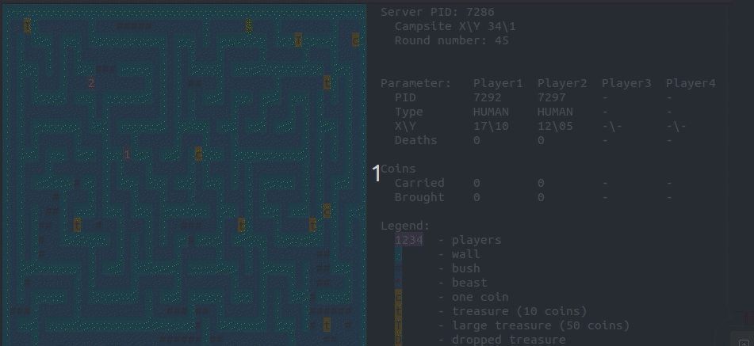
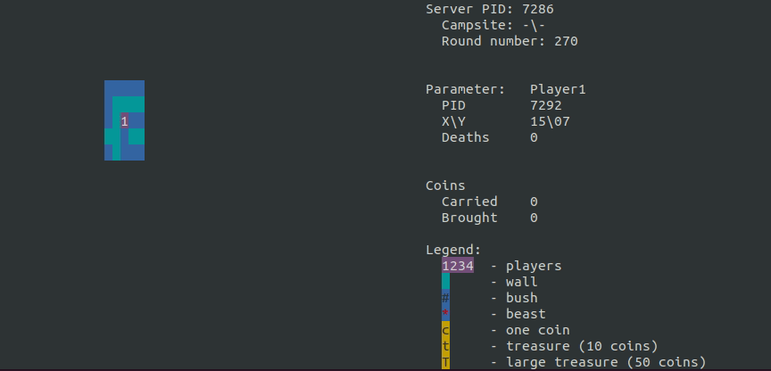

# Multiprocess game

## About the project



This is a simple maze running game made using multithreading and IPC mechanisms. The game is divided into server and client part. Up to 4 clients can play.
The goal for the players is to collect coins and bring them back to the campsite avoiding other players and beasts on their way. The game is divided into round, 1 round = 1 move. Take a note that walking through a bush takes 2 rounds.

## Installation

Install ncurses library,
```
sudo apt-get install libncurses5-dev libncursesw5-dev
```
use provided makefile.
```
make
```
Then run server
```
./server
```
and players
```
./player
```

## About server

You can control the map using following keys:
- **c** - spawn 1 coin
- **t/T** - spawn 10 coins / 50 coins
- **b/B** - spawn a beast
- **q** - quit the game **use this to quit the game or else shared memory files will be left around, if you do so delete them manually from /dev/shm**

## About player



As a player you have your sight limited. The data is provided by server every round, and as a player you cannot change your statistics, positon etc. since all the data is stored on server and refreshed every round.
- **w/a/s/d** - move
- **q** - quit